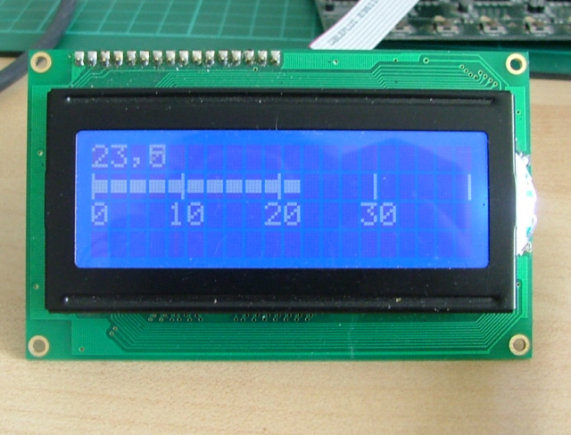

# -Bascom_avr-Thermometer.4

 

### This repository is Digital Thermometer .
   This is a simple digital thermometer with an MCU, measuring the temperature with a resolution of 1 °C. As the temperature sensor an integrated circuit LM35 is used and the temperature is displayed on a 20*4 CH-LCD.

###### This repository contains Source Files & Proteus Circuit Simulation Files. 

---

 
